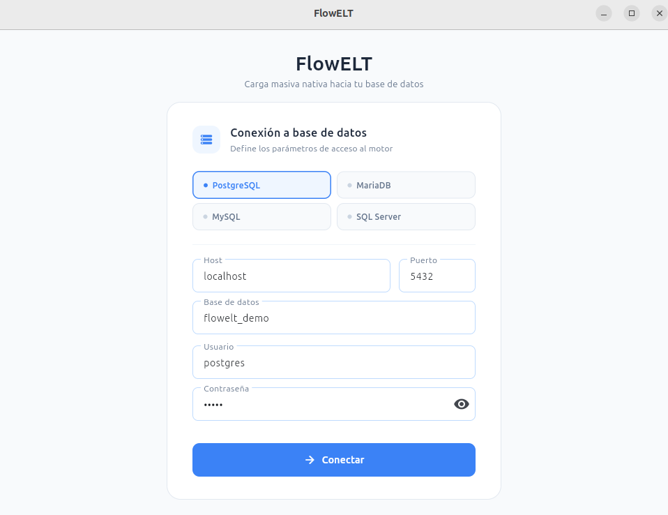
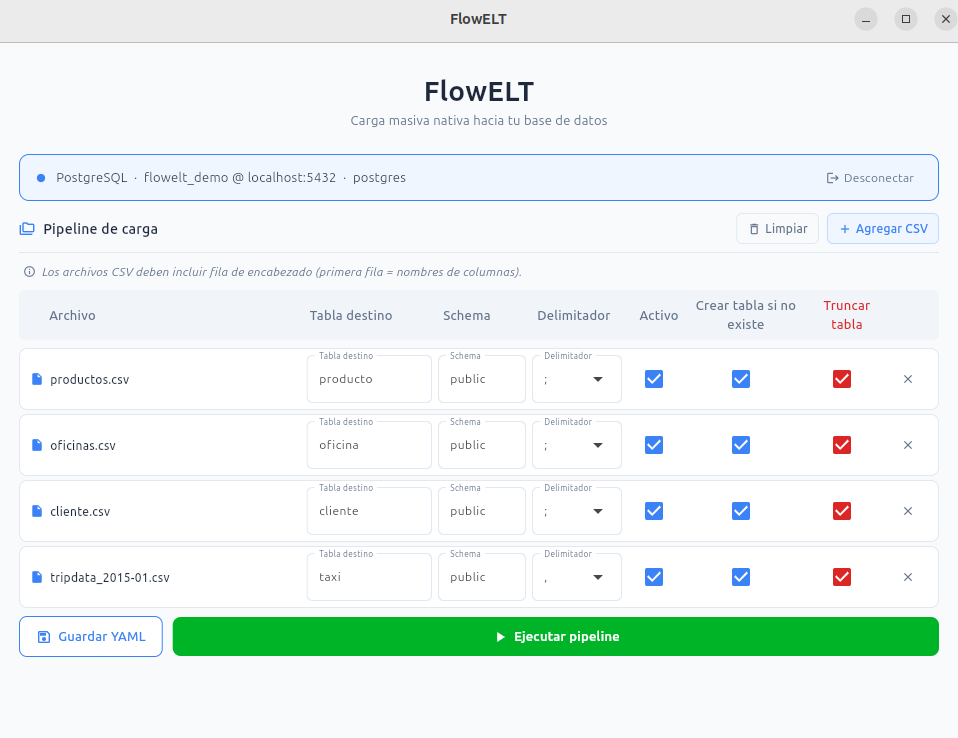
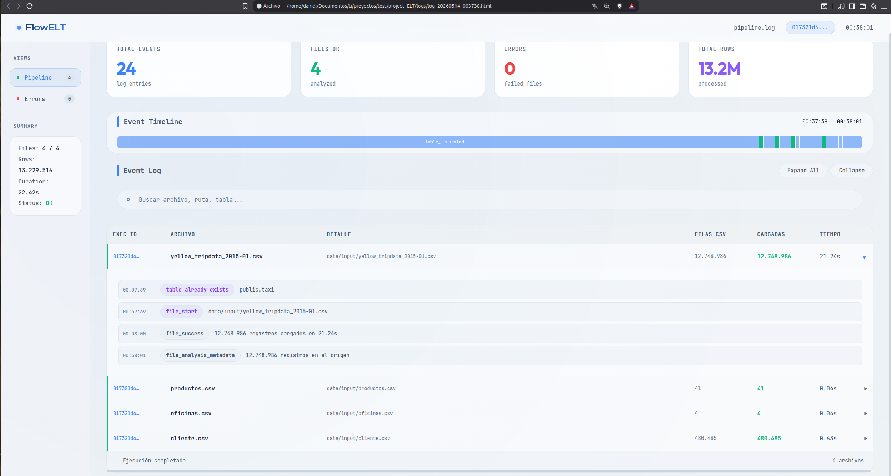

# FlowELT


> Motor ELT ligero y de alto rendimiento para entornos on-premise.
> Diseñado para simplicidad, observabilidad y flujos reales de ingeniería de datos.

---

## ¿Qué es FlowELT?

**FlowELT** es un motor ELT configurable que permite la carga masiva de archivos planos (CSV/TXT) hacia múltiples motores de bases de datos utilizando sus herramientas nativas de alto rendimiento.

> **Proveer una alternativa simple, reproducible y observable a herramientas de datos complejas.**

---

## ¿Por qué FlowELT?

El patrón habitual en pipelines de datos con Python:

```python
# Lo que se ve en producción
df = pd.read_csv("archivo.csv")             # carga todo a RAM
df.to_sql("tabla", engine, chunksize=1000)  # inserta fila por fila
```

Funciona para volúmenes pequeños. Cuando el archivo crece, el proceso pasa de minutos a horas.

**FlowELT propone un enfoque distinto:**

- Carga masiva nativa por motor de base de datos (sin pasar datos por Python)
- Configuración declarativa mediante YAML
- Compatibilidad total con entornos on-premise
- Observabilidad integrada — logs estructurados + dashboard HTML por ejecución
- Sin dependencias de orquestadores pesados

---

## Rendimiento

| Archivos | Volumen total | Filas      | Duración   | Motor      | Escenario  | Método               |
|----------|---------------|------------|------------|------------|------------|----------------------|
| 4        | ~2 GB         | 13.229.516 | 31.2s      | PostgreSQL | A (Docker) | `COPY FROM`          |
| 4        | ~2 GB         | 13.229.516 | 31.73s     | SQL Server | A (Docker) | `BULK INSERT`        |
| 4        | ~2 GB         | 13.229.516 | 69.85s     | MariaDB    | A (Docker) | `LOAD DATA INFILE`   |

> Hardware: Intel Core i3-1005G1 @ 1.20GHz / 11 GB RAM / Ubuntu Linux / NVMe interno.

---

## Bases de datos soportadas

| Motor      | Método de carga nativa  |
|------------|-------------------------|
| PostgreSQL | `COPY FROM`             |
| SQL Server | `BULK INSERT`           |
| MariaDB    | `LOAD DATA INFILE`      |
| MySQL 8    | `LOAD DATA INFILE`      |

---

## Modos de uso

| | Opción 1 — Docker | Opción 2 — Visual local |
|---|---|---|
| **Cuándo usarlo** | Sin BD instalada, demo, pruebas | Ya tienes una BD instalada |
| **Requisito** | Docker + Docker Compose | Python 3.14 + BD propia |
| **Interfaz** | CLI (contenedor) | GUI visual |
| **Archivos CSV** | Dentro de `./data/input/` | Cualquier ruta del equipo |

---

## Opción 1 — Docker

La BD y la app corren en contenedores. No necesitas instalar nada más que Docker.

### Prerrequisitos

- [Docker](https://docs.docker.com/get-docker/) + Docker Compose

> **Linux:** si instalaste Docker recientemente, agrega tu usuario al grupo `docker` para no necesitar `sudo`:
> ```bash
> sudo usermod -aG docker $USER
> ```
> Cierra sesión y vuelve a entrar para que el cambio tome efecto.

### Paso 1 — Clonar

```bash
git clone https://github.com/daniel-dev-g/project_ELT.git
cd project_ELT
```

### Paso 2 — Configurar entorno

**Linux / macOS / Git Bash / PowerShell:**
```bash
cp .env.example .env
```

**Windows cmd.exe:**
```bat
copy .env.example .env
```

Los valores del `.env.example` son suficientes — Docker configura la BD automáticamente.

### Paso 3 — Seleccionar motor

Edita `.env`:

```env
DB_ENGINE=postgres     # postgres | sqlserver | mariadb | mysql8
```

### Paso 4 — Agregar archivos CSV

```
data/
└── input/
    ├── clientes.csv
    └── ventas.csv
```

### Paso 5 — Configurar pipeline

Edita `config/pipeline.yaml`:

```yaml
_defaults:
  schema: "public"      # public → PostgreSQL | dbo → SQL Server | "" → MariaDB / MySQL
  delimiter: ";"
  crear_tabla_si_no_existe: true
  truncate_before_load: false
  active: true

task:
  - name: "Carga clientes"
    file: "data/input/clientes.csv"   # relativo a la raíz del proyecto
    delimiter: ";"
    encoding: "utf8"
    table_destination: "clientes"
    schema: "public"
    crear_tabla_si_no_existe: true
    truncate_before_load: false
    active: true
```

> **Requisito:** Los archivos CSV deben incluir fila de encabezado (primera fila = nombres de columnas).

### Paso 6 — Ejecutar

```bash
# PostgreSQL
docker compose --profile postgres up

# SQL Server
docker compose --profile sqlserver up

# MariaDB 11
docker compose --profile mariadb up

# MySQL 8
docker compose --profile mysql8 up
```

> **Primera ejecución o tras actualizar el proyecto:** agrega `--build`:
> ```bash
> docker compose --profile postgres up --build
> ```

Al terminar verás en `logs/` el dashboard HTML y el log estructurado.

#### Puertos expuestos (para conectar con DBeaver u otro cliente)

| Motor      | Puerto local |
|------------|-------------|
| PostgreSQL | `5433`      |
| SQL Server | `1433`      |
| MariaDB 11 | `3307`      |
| MySQL 8    | `3308`      |

---

## Opción 2 — Visual local (GUI)

Corre FlowELT con interfaz gráfica directamente en tu máquina.

> **Requisito previo:** esta opción asume que ya tienes instalada y corriendo una de las bases de datos soportadas (PostgreSQL, SQL Server, MariaDB o MySQL). Si necesitas instalarla, consulta la documentación oficial de cada motor.

### Prerrequisitos

- Una BD soportada ya instalada y corriendo

> `uv` gestiona Python 3.14 automáticamente — no necesitas instalarlo manualmente.

**Solo si usas SQL Server:**

**Linux (Ubuntu / Debian):**
```bash
curl -fsSL https://packages.microsoft.com/keys/microsoft.asc \
  | sudo gpg --dearmor -o /usr/share/keyrings/microsoft.gpg
echo "deb [arch=amd64 signed-by=/usr/share/keyrings/microsoft.gpg] \
  https://packages.microsoft.com/debian/12/prod bookworm main" \
  | sudo tee /etc/apt/sources.list.d/mssql-release.list
sudo apt-get update
sudo ACCEPT_EULA=Y apt-get install -y msodbcsql18 unixodbc-dev
```

**Windows:** descarga e instala [ODBC Driver 18 for SQL Server](https://learn.microsoft.com/en-us/sql/connect/odbc/download-odbc-driver-for-sql-server). El wizard lo registra automáticamente.

### Paso 1 — Clonar

```bash
git clone https://github.com/daniel-dev-g/project_ELT.git
cd project_ELT
```

### Paso 2 — Instalar dependencias

**Linux / macOS:**
```bash
bash install.sh
```

**Windows:**
```bat
install.bat
```

El script instala `uv` si no está presente y ejecuta `uv sync` para instalar todas las dependencias del proyecto.

### Paso 3 — Lanzar la GUI

> **Linux:** Si previamente ejecutaste la Opción 1 (Docker), el directorio `logs/` puede pertenecer a `root` y la GUI no podrá escribir logs. Corrígelo antes de continuar:
> ```bash
> sudo chown -R $USER:$USER logs/
> ```

```bash
uv run python gui.py
```

La interfaz permite:

- Conectar a cualquier motor con un formulario visual
- Agregar archivos CSV desde cualquier carpeta del equipo
- Configurar tabla destino, esquema, delimitador y opciones por archivo
- Guardar el pipeline en `config/pipeline.yaml`
- Ejecutar la carga y ver el resultado en pantalla
- Abrir el dashboard HTML de la ejecución con un clic







---

## Arquitectura

```
Archivos CSV / TXT
        │
        ▼
┌───────────────────┐
│  Capa validación  │  conexión, tablas, permisos BULK
└────────┬──────────┘
         │
         ▼
┌───────────────────┐
│  Análisis Polars  │  metadata, tipos, estadísticas
└────────┬──────────┘
         │
         ▼
┌───────────────────┐
│  Motor de carga   │  BULK INSERT / COPY / LOAD DATA
│  (nativo por BD)  │
└────────┬──────────┘
         │
         ▼
┌───────────────────┐
│  Observabilidad   │  JSON estructurado + Dashboard HTML
└───────────────────┘
```

---

## Outputs

| Archivo          | Descripción                           |
|------------------|---------------------------------------|
| `log_*.json`     | Log estructurado de ejecución         |
| `log_*.html`     | Dashboard HTML interactivo            |
| `technical.log`  | Log técnico interno                   |

Todos los outputs comparten el mismo `execution_id` para trazabilidad completa.

**Demo del dashboard** → [Ver ejemplo en vivo](https://htmlpreview.github.io/?https://github.com/daniel-dev-g/project_ELT/blob/main/logs/examples/log_example.html)

---

## Tecnologías

| Componente    | Tecnología        |
|---------------|-------------------|
| Lenguaje      | Python 3.14       |
| GUI           | Flet (Flutter)    |
| Análisis      | Polars            |
| Configuración | YAML + .env       |
| Logging       | JSON estructurado |
| Visualización | HTML Dashboard    |
| Contenedores  | Docker + Compose  |
| Gestión deps  | uv                |

---

## Decisiones de diseño

| Decisión | Razón |
|---|---|
| Carga masiva nativa en lugar de Python | Rendimiento — la BD lee directo del disco sin pasar datos por memoria |
| Configuración YAML | Simplicidad y reproducibilidad sin tocar código |
| `execution_id` por ejecución | Trazabilidad completa entre logs, dashboard y técnico |
| `bulk_path_map` | Desacopla la ruta de Python de la ruta de la BD en Docker |
| Polars en lugar de pandas | Velocidad y bajo consumo de memoria en análisis de metadatos |
| Factory pattern para adaptadores | Desacoplamiento de motores — mismo pipeline, distinta BD |

---

## Estado de pruebas

| Motor      | Estado   | Escenario probado  | Método               |
|------------|----------|--------------------|----------------------|
| PostgreSQL | Probado  | Docker + local     | `COPY FROM` / STDIN  |
| SQL Server | Probado  | Docker             | `BULK INSERT`        |
| MariaDB    | Probado  | Docker             | `LOAD DATA INFILE`   |
| MySQL 8    | Probado  | Docker             | `LOAD DATA INFILE`   |

---

## Roadmap

- [x] **Interfaz gráfica** (Flet) — formulario de conexión, selector de archivos, ejecución visual, dashboard integrado
- [ ] Empaquetado como ejecutable nativo (PyInstaller) — sin Python ni dependencias
- [ ] Módulo de profiling (nulos, cardinalidad, tipos)
- [ ] Motor de reglas de calidad configurables en YAML
- [ ] **Linaje a nivel de fila** — columnas `_execution_id`, `_source_file`, `_load_timestamp` en capa raw via SQL post-carga
- [ ] Integración con Airflow o Prefect

---

## Arquitectura con linaje (roadmap)

La carga nativa no permite inyectar columnas adicionales durante la transferencia. El diseño propuesto lo agrega en un paso SQL posterior, dentro de la BD, sin pasar datos por Python.

```
PASO 1 — Carga nativa (sin cambios)
CSV ──► BULK INSERT / COPY ──► landing.clientes   ← datos puros

PASO 2 — SQL post-carga (dentro de la BD)
INSERT INTO raw.clientes
SELECT c.*, l.execution_id AS _execution_id,
            l.source_file  AS _source_file,
            l.load_timestamp AS _load_timestamp
FROM landing.clientes c
JOIN bd_logs l ON l.task_id = '<task_id_actual>'
```

---

## Objetivo del proyecto

FlowELT no busca ser un producto comercial.

Su propósito es demostrar prácticas reales de ingeniería de datos, explorar patrones escalables de ELT y construir una alternativa ligera a herramientas complejas — evidenciando decisiones de ingeniería, no solo código.

---

## Autor

**Daniel Guevara**
Data Engineer | Python | SQL | GCP | Santiago, Chile

- GitHub: [daniel-dev-g](https://github.com/daniel-dev-g)
- LinkedIn: [daniel-guevara](https://www.linkedin.com/in/daniel-guevara-2a64a479/)

---

> *Las herramientas de ingeniería de datos deberían ser simples, transparentes y eficientes — no complejas por defecto.*
