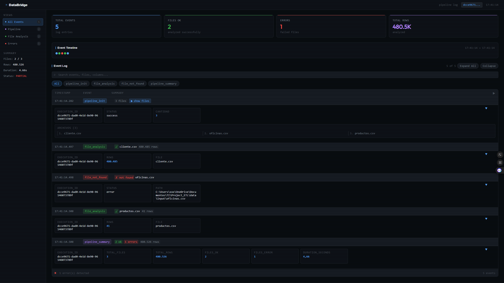

# DataBridge — Carga masiva de archivos a SQL Server

> Herramienta ETL desarrollada en Python que automatiza la carga de archivos CSV/TXT hacia SQL Server mediante BCP.
> Pipeline configurable por YAML, con auditoría estructurada y dashboard de ejecución.
> Alternativa ligera a SSIS y Airflow para analistas que necesitan cargas masivas sin infraestructura DevOps..

---

## ⚡ Rendimiento

| Archivos | Filas   | Duración |
| -------- | ------- | -------- |
| 3        | 480.526 | 4.3s     |

> Carga realizada con BCP sobre SQL Server en entorno local Windows.

---

## 🚀 Descripción

DataBridge automatiza el proceso de carga masiva desde archivos planos hacia SQL Server.

El pipeline analiza los archivos con Polars, valida su estructura, ejecuta la carga con BCP y genera un log estructurado en JSON junto a un dashboard HTML interactivo con el resumen de ejecución.

---

## 📌 Problema que resuelve

Las cargas manuales de archivos planos suelen ser lentas, poco auditables y difíciles de mantener. DataBridge permite:

- Automatizar cargas masivas de datos mediante configuración YAML
- Registrar cada ejecución con trazabilidad completa por `execution_id`
- Detectar errores de estructura antes de la carga
- Generar reportes de ejecución sin intervención manual
- Separar lógica de negocio y configuración

---

## 📊 Dashboard de Monitorización

Haz clic en el siguiente enlace para ver el dashboard interactivo con los resultados de la última ejecución del pipeline:

[**→ Ver Dashboard Interactivo ←**](https://htmlpreview.github.io/?https://github.com/daniel-dev-g/project_ELT/blob/main/logs/log_20260302_174109.html)

_(El dashboard muestra KPIs como total de eventos, archivos procesados, errores y un registro detallado de la ejecución.)_

<p align="center">
  
</p>

## 🛠️ Tecnologías

| Componente    | Tecnología                |
| ------------- | ------------------------- |
| Lenguaje      | Python 3.11+              |
| Base de datos | SQL Server (Windows Auth) |
| Carga masiva  | BCP Utility               |
| Análisis      | Polars                    |
| Configuración | YAML                      |
| Auditoría     | JSON + Dashboard HTML     |
| Gestión deps  | uv                        |

---

## 🧠 Flujo del proceso

```
CSV/TXT → Validación → Análisis (Polars) → BCP → SQL Server
                                               ↓
                                    JSON Log → Dashboard HTML
```

**Detalle de fases:**

1. Lectura de configuración desde `pipeline.yaml`
2. Validación de conexión a SQL Server
3. Análisis de archivos con Polars (encoding, columnas, filas)
4. Carga masiva a SQL Server mediante BCP
5. Registro de ejecución en log JSON
6. Generación de dashboard HTML

---

## 📦 Requisitos

- Python 3.11 o superior
- SQL Server (local o remoto, Windows Authentication)
- BCP Utility disponible en el sistema (`bcp` en PATH)
- uv instalado (`pip install uv`)

---

## ⚙️ Instalación

### 1. Clonar repositorio

```bash
git clone https://github.com/daniel-dev-g/project_ELT.git
cd project_ELT
```

### 2. Instalar dependencias

```bash
pip install uv
uv sync
```

---

## 🔧 Configuración

### `config/settings.yaml`

```yaml
development:
  server: "NOMBRE_SERVIDOR"
  database: "NOMBRE_DB"
  log_level: "WARNING" # DEBUG para desarrollo, WARNING para producción
```

> El proyecto usa Windows Authentication. No se requiere usuario ni contraseña.

### `config/pipeline.yaml`

```yaml
# Formatos soportados: .csv, .txt
task:
  - name: "Carga de Clientes"
    file: "data/input/clientes.csv"
    delimiter: ";"
    encoding: "utf8"
    table_destination: "clientes"
    schema: "dbo"
    active: true
```

---

## ▶️ Ejecución

```bash
python main.py
```

Al finalizar se generan automáticamente:

- `logs/log_TIMESTAMP.json` — log estructurado de la ejecución
- `logs/log_TIMESTAMP.html` — dashboard HTML interactivo

---

## 📁 Estructura del proyecto

```
project_ELT/
├── config/
│   ├── settings.yaml          # Configuración de conexión y entorno
│   └── pipeline.yaml          # Definición de tareas de carga
├── data/
│   └── input/                 # Archivos CSV/TXT de entrada
├── logs/                      # Logs JSON y dashboard HTML por ejecución
├── src/
│   ├── bulk_loader.py         # Carga masiva con BCP
│   ├── csv_analisys.py        # Análisis de archivos con Polars
│   ├── log_csv.py             # Registro de auditoría JSON
│   ├── log_dashboard.py       # Generador de dashboard HTML
│   ├── validators/            # Validaciones de conexión y archivos
│   └── state_manager/         # Gestión de estado de ejecución
├── main.py                    # Punto de entrada
└── pyproject.toml             # Dependencias del proyecto
```

---

## 📊 Outputs

| Archivo                   | Descripción                                          |
| ------------------------- | ---------------------------------------------------- |
| `logs/log_*.json`         | Log de auditoría por ejecución (negocio)             |
| `logs/log_*.html`         | Dashboard HTML interactivo                           |
| `logs/technical.log`      | Log técnico del proceso (DEBUG/INFO/WARNING/ERROR)   |
| `src/metadata.csv`        | Métricas por archivo (filas, encoding, tamaño, etc.) |
| `src/metadata_detail.csv` | Inventario de columnas por archivo                   |

> `log_*.json` registra eventos de negocio (archivos procesados, filas cargadas, errores).
> `technical.log` registra eventos técnicos internos (conexiones, validaciones, tiempos).
> Ambos se generan en cada ejecución y comparten `execution_id`.

## Todos los outputs comparten `execution_id` para trazabilidad completa.

## 🎯 Características principales

- Pipeline 100% configurable por YAML sin modificar código
- Carga masiva con BCP — más rápido que SQLAlchemy/pandas
- Análisis previo de archivos con Polars (encoding, columnas, filas)
- Log estructurado en JSON con `execution_id` por ejecución
- Dashboard HTML interactivo con timeline, KPIs y detalle por evento
- Trazabilidad completa entre log, metadata y carga

---

## 🧭 Roadmap

- [ ] Ejecución de stored procedure post-carga (`post_load_sp`)
- [ ] Soporte PostgreSQL via `COPY FROM`
- [ ] Duración por archivo en dashboard
- [ ] Ejecución programada
- [ ] Contenerización con Docker

---

## 👨‍💻 Autor

**Daniel Guevara**
Data Engineer | SQL Server | Python | GCP
Santiago, Chile

- LinkedIn: [linkedin.com/in/daniel-guevara](https://www.linkedin.com/in/daniel-guevara-2a64a479/)
- GitHub: [github.com/daniel-dev-g](https://github.com/daniel-dev-g)
